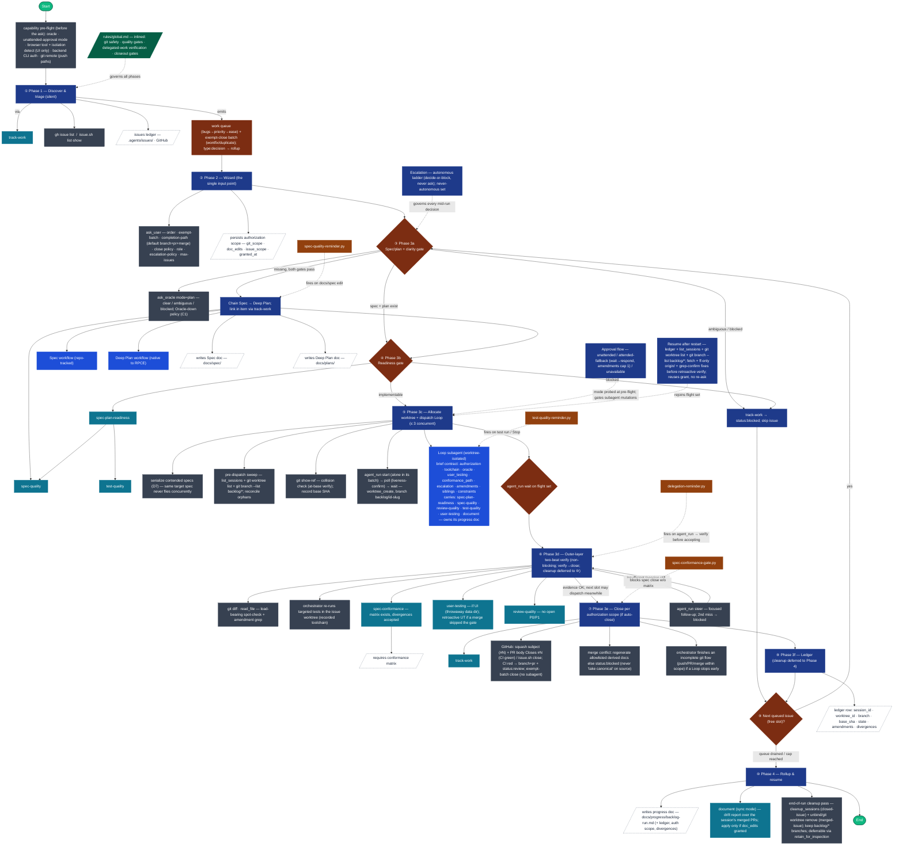

# Backlog Workflow — Dependency Graph

Chronological dependency flow for the **Backlog** workflow (`/.agents/workflows/Backlog.md`), top to bottom, following its phases ①–⑩. Each dependency hangs off the phase that actually uses it; branch points show the decision; the inlined rule, the four hooks, and the cross-cutting autonomy sections (Approval flow, Escalation, Resume) ride along the side rail, firing at the step that triggers them.

## Graph

### How to read it

- **Read top → bottom.** The spine is Backlog's phase flow ① → ⑩, preceded by the capability pre-flight that gates the wizard. Diamonds are decision/branch points; rounded nodes are phases; the pill nodes are start/end.
- **Dependencies hang off the phase that uses them**, colored by type: 🟦 phase/decision · 🟦 workflow · 🟦 skill · ⬛ tool · □ doc artifact.
- **Side rail (dashed).** `rules/global.md` is inlined by Backlog and governs every phase; the three autonomy sections (**Approval flow**, **Escalation**, **Resume after restart**) are cross-cutting and attach where they bite; the four **hooks** are guardrails Backlog never calls but is subject to — each is drawn firing at the step that triggers it (`agent_run` return → 3d verify; spec close → 3e; `docs/spec` edit → the Spec chain; test run → inside Loop).
- **Loops:** ③–⑧ repeat per issue (max 3 in flight); ⑥ can re-steer a delegate before it advances; ⑨ feeds the next queued issue back into ③ until the queue drains. **Resume** re-enters at ⑤ from the persisted ledger without re-running the wizard.

## Responsibilities

### Root

| Part | Responsibility |
|---|---|
| **Backlog workflow** (`workflows/Backlog.md`) | Orchestrator. Runs a capability pre-flight, discovers/triages tracked issues (bugs → priority → ease) emitting a work queue + exempt-close batch, runs the **single** upfront wizard (the only `ask_user` of the run) and persists an authorization scope, allocates one unique worktree+branch per issue, dispatches each to a worktree-isolated **Loop** subagent (max 3 concurrent), verifies closeout evidence independently (two-beat), and closes the item via **track-work** within the authorized scope. Mid-run decisions follow an autonomous escalate-or-block ladder. Owns triage, sequencing, outer-layer verification, and closure — never the implementation detail. |

### Workflows

| Part | Responsibility |
|---|---|
| **Loop** | Per-issue implementation engine. Consumes a Spec + Deep Plan, verifies readiness, then runs red/green/review/refactor loops with delegation and a resumable progress doc. Runs **orchestrated** (brief carries an authorization scope + `escalation.principal: orchestrator` → routes asks to Backlog, never the end-user; git actions gated by the scope) or **interactive** (default → today's ask-the-user behavior). Produces the spec-conformance matrix at closeout; isolates user-testing data. Dispatched by Backlog as a worktree-isolated subagent; **must not change issue status**. |
| **Spec** | Elicits intent, drafts Given/When/Then scenarios and constraints, checks for redundancy/gaps/ambiguity, and writes a minimal contract-level spec to `docs/spec/`. Chained by Backlog (Phase 3a) when an issue has no linked spec. |
| **Deep-Review** *(optional)* | Maps a change set and runs parallel context-grounded review shots across lenses (correctness, maintainability, security, tests, docs), then governs findings (stable signatures, dedup, revalidation). Pairs with Loop — not a hard dependency. |
| **Deep Plan** *(native to RPCE)* | Native RepoPrompt CE workflow — not tracked in this repo's `.agents/workflows/`, but available to RPCE natively. Chained by Backlog after Spec (Phase 3a) to produce the ordered implementation plan: tasks, affected areas, dependencies, validation, risks, task↔scenario mapping. Its output Deep Plan doc is what Loop consumes. |

### Skills

| Part | Responsibility |
|---|---|
| **track-work** | Backend-agnostic status ledger. Selects GitHub vs file from override/origin identity, blocks rather than silently falling back when capability is unavailable, creates/updates one item per work item, applies labels/status lifecycle, links spec/plan/progress, and owns close semantics. |
| **spec-plan-readiness** | Deterministic go/no-go gate run before implementation: checks for missing inputs, unresolved spec blockers, incomplete/contradictory plans, task↔scenario traceability, scenario→test-layer mapping, and selects the first safe task. A `blocked` verdict authorizes no code. |
| **spec-conformance** | Section-by-section spec-vs-implementation audit producing a Conformed/Diverged/Not-built matrix with coverage proof. Required at closeout — Backlog checks the matrix exists and that every Diverged/Not-built item is accepted with reason. Emits `docs/spec/<spec>.conformance.md` (canonical path; Backlog serializes contended specs rather than renaming it). |
| **user-testing** | Verifies a frontend change actually works for the user by driving the real rendered UI through actual workflows, screenshotting each step (or an explicit user hand-off), against a **throwaway/isolated data location — never the user's real environment data**. Automated tests passing is not sufficient for UI closeout. |
| **spec-quality** | Keeps specs contract-level, observable, non-redundant, grounded in repo context, and free of implementation planning. Used as supporting input by the readiness gate and by Spec/track-work. |
| **test-quality** | Governs that tests protect behavior (named plausible defect, exact observable assertions, lowest faithful layer, no coverage-padding). Vetoes low-value tests. |
| **review-quality** | Governs review findings: structured evidence, prompt-grounding, a revalidation gate that refuses model-only "fixed", and stable-signature triage/dedup/rerank. Used inside Loop's review phase. |
| **document** | Dry-run documentation sync/audit against code changes — reports affected docs, proposed edits, unsupported claims, and contract-doc conflicts; writes only on explicit approval. Used in Loop closeout (and to keep this very graph in sync). |

### Slash commands (skill shortcuts)

| Part | Responsibility |
|---|---|
| **/commit** | Shortcut to the `commit` skill — commits staged changes in logical groups. Reached transitively via track-work ("Commit with the commit skill"). |
| **/document** | Shortcut to the `document` skill — syncs or audits docs against code, dry-run by default unless `apply` is explicit. |

### Tools (RPCE MCP / git)

| Part | Responsibility |
|---|---|
| **ask_user** | The Phase 2 wizard — the **single** input point (triage order, exempt-close batch, completion path default `branch+pr+merge`, close policy, per-issue role, escalation policy, max issues), then unattended. The capability pre-flight runs first so gaps surface here. |
| **ask_oracle** (`mode=plan`) | Independent clarity gate (Phase 3a) — returns `clear / ambiguous / blocked`; **Oracle-down policy (C1)**: existing-spec issues proceed degraded, spec-needing issues block. Also pinged at the pre-flight. |
| **agent_run** (`start/wait/poll/steer`) | Dispatches (start, **alone in its tool batch**), liveness-confirms (`poll`), waits on, and resumes the worktree-isolated Loop subagents (flight set ≤ 3). `steer` resumes a live session; it cannot launch a half-provisioned one. |
| **agent_manage** (`list_sessions` / `cleanup_sessions`) | `list_sessions` feeds the pre-dispatch sweep and resume; `cleanup_sessions` dismisses closed-issue Loop sessions at the **end-of-run cleanup pass** (**may skip** — orphans are routed around, not revived). |
| **manage_worktree** (`list/unbind/bind`) | Worktree reconciliation — `bind` rebinds to an existing worktree (resume/recovery); `unbind` severs the session binding before `git worktree remove` (post-merge only). |
| **git · read_file · gh** | Pre-dispatch sweep + collision check (`git show-ref`, at-base verify), base-SHA recording, outer-layer two-beat verify (`git diff` / `read_file` + amendment grep + orchestrator re-runs targeted tests), and GitHub ops (`gh`, via track-work). |
| **issue.sh · place_on_board.sh** | track-work's helper scripts — file-backend issue CRUD (`issue.sh`) and GitHub Project board placement (`place_on_board.sh`). |

### Hooks (guardrails — never called, but fire during a run)

| Part | Responsibility |
|---|---|
| **delegation-reminder.py** | `PostToolUse` on `agent_run` returns — reminds the orchestrator that a delegate's report is a claim, not evidence, and must be independently verified. **Most relevant hook** — Backlog is a heavy delegator; it lands at the 3d verify step. |
| **spec-conformance-gate.py** | `PostToolUse` on spec edits — blocks closing a spec to a terminal status (`done/shipped/...`) when no conformance matrix exists. Backstop on Backlog's 3e close. |
| **spec-quality-reminder.py** | `PostToolUse` on `docs/spec/*.md` edits — nudges running the `spec-quality` skill. Fires during the Spec chain (3a). |
| **test-quality-reminder.py** | `PostToolUse` on test-run commands + `Stop` — blocks stopping with uncommitted test files changed since the last run; nudges `test-quality` vetting. Fires inside Loop. |

### Cross-cutting sections (in the workflow, not the phase spine)

| Part | Responsibility |
|---|---|
| **Approval flow** | Subagent approval mode probed at pre-flight: `unattended` (subagents mutate without approvals), `attended-fallback` (orchestrator answers via `wait`→`respond`; amendments capped at 1), or `unavailable` (affected issues auto-block). Treats the mechanism as a capability probe, not an assumption. |
| **Escalation** | Autonomous ladder for every mid-run decision: never-autonomous set → blocked; oracle-decidable → decide + record; oracle-down → decide from policy or block. **No branch reaches `ask_user`.** |
| **Resume after restart** | Reconstructs flight state from the ledger joined with `list_sessions` + `git worktree list` + `git branch --list 'backlog/*'`, **fast-forwards local default to `origin/<default>` (`--ff-only`) and grep-confirms each fix is present before any retroactive verify/user-testing (R1)**, reuses the persisted grant without re-running the wizard, and blocks anything unreconcilable. |

### Rule (inlined)

| Part | Responsibility |
|---|---|
| **rules/global.md** | Canonical cross-cutting hard rules inlined by every workflow: Git Safety, Stable Identifiers, Test Quality, Review Quality, Minimalism/Economy, Spec–Implementation Reconciliation (closeout gate), Frontend/User-Facing Verification, and Verifying Delegated Work (acceptance gate). |

### Artifacts (docs written / read)

| Part | Responsibility |
|---|---|
| **Spec doc** (`docs/spec/`) | Behavioral contract — scenarios (S-NNN), constraints, Proposed Surface, Open Questions. Written by Spec; consumed by the readiness gate and Loop. |
| **Deep Plan doc** (`docs/plans/`) | Ordered implementation plan — tasks, affected areas, dependencies, validation, risks, task↔scenario mapping. Produced by the native **Deep Plan** workflow; consumed by Loop. |
| **`<base>.conformance.md` matrix** | Coverage proof produced by `spec-conformance` — Backlog requires it before closing. Canonical path; contended specs are serialized, not renamed. |
| **progress doc** (`docs/progress/`) | Resumable run state. Backlog writes `docs/progress/backlog-<run>.md` carrying the **wizard answers + authorization scope + per-issue ledger** (`session_id`, `worktree_id`, branch, base SHA, lifecycle state, amendments, divergences); Loop writes `docs/progress/<slug>-loop.md` (linked, not duplicated). |
| **issues ledger** (`.agents/issues/` or GitHub) | The status source of truth — one item per work item. Read for discovery, written for blocked/close via track-work. |

## Notes

- **track-work is the hub.** Discovery, blocked-marking, spec/plan linking, exempt-close, and closing all go through it, which transitively pulls in `spec-plan-readiness`, `spec-quality`, `test-quality`, the `commit` skill, and the `issue.sh` / `place_on_board.sh` scripts.
- **The transitive skill set is 8 deep.** Through Loop + track-work + the readiness/conformance gates, Backlog ultimately touches: `track-work`, `spec-plan-readiness`, `spec-conformance`, `user-testing`, `spec-quality`, `test-quality`, `review-quality`, `document`.
- **Autonomy is structural, not advisory.** The wizard is the only `ask_user`; the Escalation ladder + never-autonomous set guarantee no mid-run question. Unattended git-visible actions require an authorization scope that only Backlog's wizard grants (bounded to the triaged `issue_scope`); standalone Loop is unaffected.
- **Hooks are guardrails, not dependencies Backlog calls.** They fire on Backlog's tool calls automatically; Backlog is subject to all four. The graph attaches each to the step it triggers from.
- **Deep-Review is optional** — it pairs with Loop for governed findings, not a hard requirement of Backlog, so it is omitted from the phase flow.
